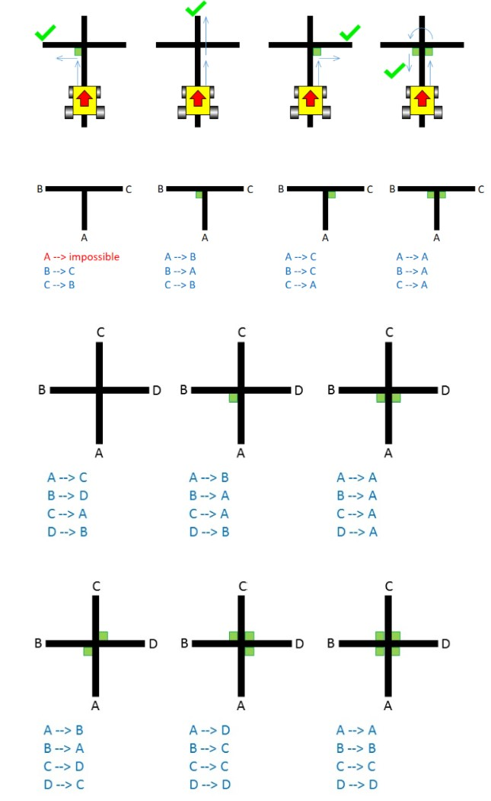
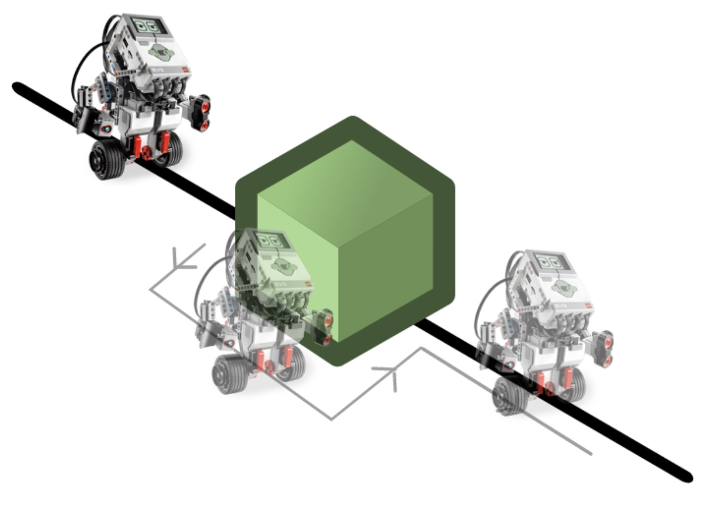

# Follow the Line
## Setup of the Course:
The floor was clear white with black lines made from tape to show the path the robot had to follow, while overcoming some obstacles. The obstacles included sharp corners, junctions where a piece of green tape would indicate which direction the robot must turn, go around an object and continue moving forward over gaps of the black line.
## Obstacles Detailed:
### Junctions:

### Go around an Object:

## Robot Setup:
The robot used in this project was from Lego Mindstorms EV3.

The program was written in Java and the lejos library was used to program the robot.

The robot used with this code, had two Colour sensors looking at the ground, one Infrared sensor looking forward and two big Motors where used for the movement.

## What the Robot does:
The Robot always moves forward with one motor moving slightly faster, meaning that it always turns slightly to one side. When one of the Colour sensors reads the Black line, the two motors change speed, meaning the robot will start turning slightly to the opposite direction. This makes sure that the robot will follow the line, but will also keep going almost straight even if there are small gaps of the line.
When the robot finds a junction it will follow the instructions above and go to the right direction.
If an object is detected by the Infrared sensor, the robot will turn 90 degrees to the right, move forward turn left, move forward, turn left again and go forward until it finds the line, then it will finally turn right and continue following the line. All of this will be done very quickly.
